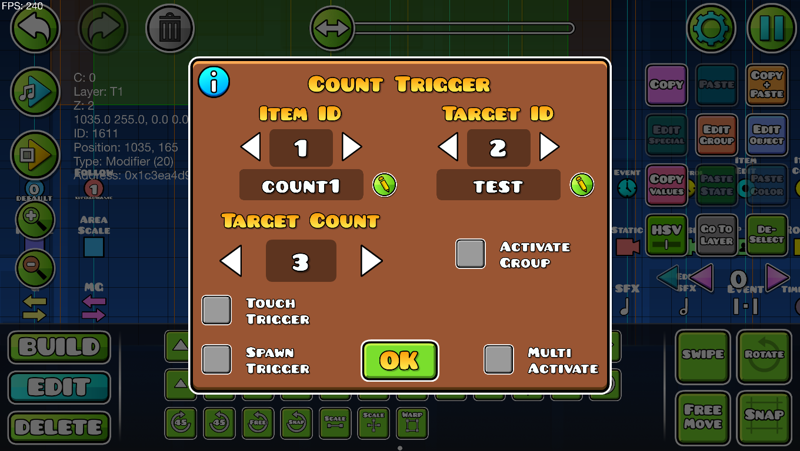
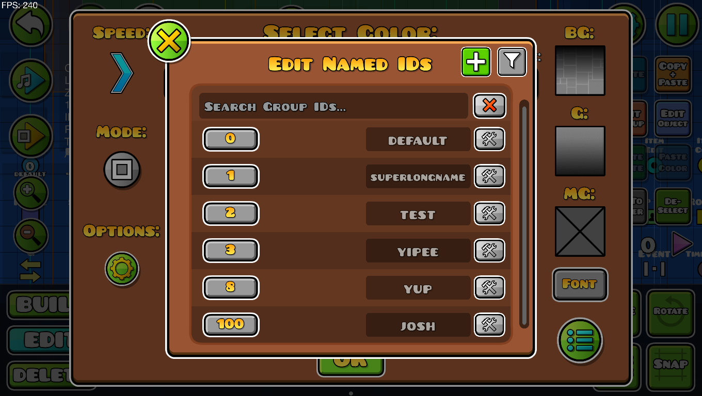

# Named Editor Groups

A mod commissioned by [Rue](https://x.com/xRueOfficial).

A mod that allows you to abstract away IDs by giving them names!





## API

This mod exposes its API through events:

- `#include <spaghettdev.named-editor-groups/api/NIDManager.hpp>` and use the methods in the NIDManager namespace
- `#include <spaghettdev.named-editor-groups/api/NIDExtrasManager.hpp>` and use the methods in the NIDExtrasManager namespace (only work if cvolton.level-id-api is loaded)
- Similarly, you can listen to some events fired by the mod, these are:
  - NewNamedIDEvent
  - NewNamedIDExtrasEvent
  - RemovedNamedIDEvent
  - RemovedNamedIDExtrasEvent

## How to install (from Geode)

1. Get [Geode](https://geode-sdk.org)
2. Click the Geode button
3. Click the download tab, find Named Editor Groups, and click Install!

## How to install (from Releases)

1. Download the latest release's Named Editor Groups geode file
2. Copy it to `Geometry Dash/geode/mods`

## How to build

Run the following commands in your preferred terminal:

```sh
git clone https://github.com/SpaghettDev/NamedEditorGroups
cd NamedEditorGroups
mkdir build
cd build
cmake ..
```

Then open the generated solution in Visual Studio.
